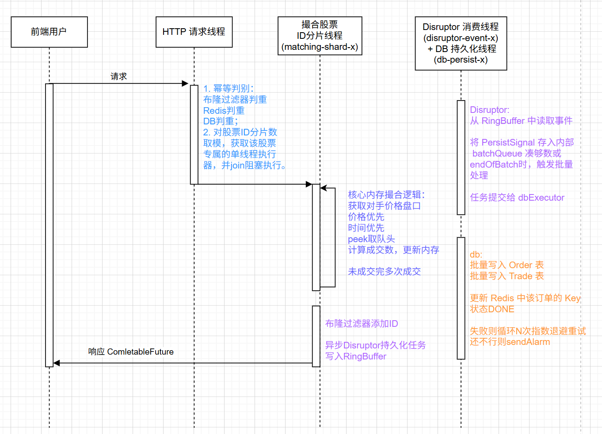
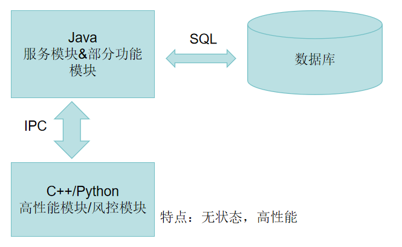
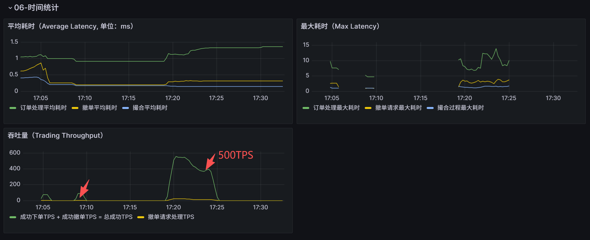

# 模拟股票交易对敲撮合系统 - Java 核心服务模块 项目文档

```Plain
## 一、项目总览
### 1.1 模块定位
### 1.2 项目目标达成情况
### 1.3 整体分层架构
### 1.4 核心架构设计亮点
### 1.5 开发时间线与里程碑
## 二、具体内容
### 2.1 项目功能简介
### 2.2 核心流程
### 2.3 任务书核心功能列表
#### 2.3.1 基础目标（必选）
#### 2.3.2 高级目标（可选）
### 2.4 Java模块测试案例全量设计
### 2.5 项目部署到远程服务器
### 2.6 系统可观测性建设(监控)
## 三、开发历程与问题解决
## 四、团队协作与分工
```

## 一、项目总览

---

### 1.1 模块定位

本模块为系统**Java [核心服务模块](docs/design.md)**，是整个模拟股票交易撮合系统的**核心调度中枢与业务落地载体**，更是全系统业务流转的核心底座。
核心承担「**请求接入→订单校验→对敲风控→内存撮合→回报生成→数据持久化**」交易全链路核心流程，同时为前端管理界面、C++ 撮合内核、Python 风控 / 行情分析模块提供标准化对接能力，实现全系统模块的协同调度与业务闭环。

---

### 1.2 项目目标达成情况

本模块严格对标项目任务书要求，全量需求高质量落地，完成度如下：

|目标类别| 落地详情                                                                                                                                       |
|---|--------------------------------------------------------------------------------------------------------------------------------------------|
|必选基础目标| 完整实现任务书要求的**交易转发、对敲风控、模拟撮合、交易回报**四大核心能力，无功能遗漏                                                                                              |
|可选高级目标| 已实现撤单全流程支持、系统性能优化、全链路监控体系、数据持久化与离线分析支持、高可用崩溃恢复等核心能力                                                                                        |
|能力拓展| 超出任务书基础要求，落地金融级交易系统必备的**架构设计**（崩溃恢复& DB任务队列& DB异步持久化& 分片撮合& 幂等& 对象池& MyBatis的session事务& 索引构建）、**数据一致性保障**（辅助开发）、**全链路日志和Grafana自定义**等工程化能力 |
---

### 1.3 整体分层架构

#### 1）撮合逻辑

优点：

1. 提升 TPS：
   - Disruptor 无锁队列（替代 BlockingQueue 和线程池）+ 股票分片（Sharding）的串行撮合 + 内存 OrderBook 无锁高速撮合；
   - 灵活使用 C++ 高效撮合模块；
   
   - [线程池模式撮合设计（已弃用）](docs/data/05-DBService.png)

2. 提升安全性：
   - **幂等性**三层防护（布隆过滤器 + Redis+ DB）；

3. 性能 & 安全：
   - 异步、批量入库（Druid、SqlSession批量操作替代foreach拼接MyBatis SQL语句）；
   - Druid连接池；
   - 为降低GC率采用对象池获取Disruptor事务对象、调整JVM启动参数、设计数据库索引等；

4. 功能：
   - 任务书中的基础功能如：价格优先 + 时间次优先等基础功能；
   - 日志系统：流程日志、错误日志、分小时操作流程日志记录；

5. 灵活：
   - 基于IPC 通信的可拆卸自敲检测和合规验证模块、撮合模块、行情模块；
   
   - [OrderBook内存撮合缓存](docs/data/03-OrderBookStructure.png)

6. 可观测：使用 Prometheus+Grafana 全流程可观测
   - 订单成交情况、TPS、SQL、JVM 全流程定制化监测（效果见2.7，[自定义指标设计](docs/monitoring/监控系统设计-表盘设计文档.md)& [自定义表盘模板](docs/monitoring/股票撮合系统监控大盘-1772781837175.json)）；
   - 系统数据库性能（mysqld-exporter）、JVM性能检测；
   

#### 2）崩溃恢复

1. 主动撮合、崩溃恢复的数据加载和撤单请求都在**分片服务**中进行，属于分片后的单线程任务；
   - [崩溃恢复设计](docs/data/04-RecoveryProcess.png)
   - [恢复后主动撮合](docs/data/04-RecoveryReMatching.png)

2. CountDownLatch 进行分片订单加载等待替代sleep；

3. 分片加载数据库数据进行处理。

#### 3）撤单

1. 撤单全流程都在**分片服务**中；

2. 复用异步写数据库能力。

---

### 1.4 核心架构设计亮点

针对证券交易系统「高并发、低延时、高可用、数据强一致」的核心诉求，本模块做了深度的架构设计优化，核心亮点如下：

- 🚀 **撮合与持久化解耦架构**
  分片撮合 + Disruptor 队列 + DB 两重线程池（重试线程池隔离问题）+ Druid 连接池 + 连接池 Gate 控制请求速度 + 对象池控制 disruptor 持久化任务创建回收 +
  Redis + 布隆过滤器（幂等验证）

- 🔒 **全链路状态机**
  基于订单状态枚举实现订单**全生命周期状态流转管控**，严格限制非法状态变更，为撤单操作、撮合执行、崩溃恢复提供强一致的状态依据，从根源上避免状态错乱导致的业务异常。

- 🏦 **金融级高可用兜底设计**
  全链路设计**重试、定期一致性检查、崩溃恢复**三大兜底机制，覆盖服务异常、数据库宕机、网络波动等各类极端场景，保障系统在异常情况下的数据一致性与服务可用性，完全符合金融交易系统的可靠性要求。

- 🧩 **Grafana 实现系统运行情况和交易情况可观测性**
  极大的方便发现系统性能问题，同时观测交易情况，是一个复合的监控系统。针对当前项目做了定制化面板指标等操作，设计文档见[此处](./docs/monitoring)。

---

### 1.5 开发时间线与里程碑

|阶段|核心成果|
|---|---|
|启动阶段|确定系统架构、模块划分、项目目录结构，完成基础设计|
|基础开发阶段|搭建 GitHub 仓库、定义 IPC 协议、完成订单持久化、基础撮合 / 风控逻辑，实现订单全流程基础功能|
|能力增强阶段|完成日志体系、自定义监控面板、撤单功能、高并发优化，部署到云端服务器|
|优化与联调阶段|对接 native 模块、完成性能优化（TPS 从 80 提升至 900+）、完成压测与架构优化，实现数据一致性检查|
---

## 二、具体内容

---

### 2.1 项目功能简介

基于 SpringBoot 实现证券交易撮合模拟系统，核心完成「**订单校验→对敲风控→撮合匹配→交易回报**」全链路，支持**撤单、性能监测**等可插拔增强模块。

1. 提供 JAVA 层的[撮合](src/main/java/com/example/trading/application/ExchangeService.java)、[对敲检测](src/main/java/com/example/trading/domain/risk/SelfTradeChecker.java)、[交易和撤单请求校验](src/main/java/com/example/trading/domain/validation)方案；

   - [提供撮合结果，](src/main/java/com/example/trading/domain/engine/result/MatchingResult.java)**[支持一笔订单分多次成交](src/main/java/com/example/trading/domain/engine/result/MatchingResult.java)**

   - [撮合引擎 Java 设计](src/main/java/com/example/trading/domain/engine/MatchingEngine.java)；

   - [订单簿作为订单内存缓存](docs/data/03-OrderBookStructure.png)（OrderBook.java）

   - [Disruptor消息队列引入](src/main/java/com/example/trading/infrastructure/disruptor)；

   - [对象池降低GC](src/main/java/com/example/trading/domain/pool)；

   - [MyBatis 实现持久化](src/main/java/com/example/trading/mapper)+Druid；

   - [线程池设计](src/main/java/com/example/trading/config/AsyncConfig.java)以及[分片任务设计](src/main/java/com/example/trading/config/ShardingMatchingExecutor.java)

   - [根据线程池状态控制Gate](src/main/java/com/example/trading/gate/ThreadPoolStatusMonitor.java)；

   - 配置：MySQL、MyBatis、Disruptor、Druid插入重试（见 6）、分页、自定义开启对敲检测（见 1）、价格策略（见 1）、崩溃重启（见 5）、性能监测（见 3）

2. [基于](src/main/java/com/example/trading/application/CancelService.java)**状态流转**机制结合撮合中的分片任务和异步持久化服务(Disruptor+DB线程池等)实现撤单功能；
   - 订单状态分为未结束（PROCESSING、MATCHING、NOT_FILLED、PART_FILLED）和已结束（RISK_REJECT、CANCELED、FULL_FILLED、REJECTED）状态，便于管理。

3. 提供**自定义和设计的图形化的性能检测平台**(JVM+SQL 检测集成)
   - 使用 Prometheus+Grafana，[开发整体启动和停止脚本，自定义表盘设计文档和模板](docs/monitoring)；

4. 提供完善的日志
   - 使用 logback 在本地自动保存**所有操作的中间日志**（[等级设置 INFO](src/main/resources/logback.xml)，路径./logs）；

5. 提供完善的崩溃恢复机制，**应用重启后**自动从数据库读取中间状态订单（状态流转机制）；
   - 见此处[图 04-**.png](docs/data)

6. 提供完善的数据库失败重试机制，独立入库线程（见 7）
   - [基于 Redis 暂存功能实现](src/main/java/com/example/trading/application/PersistRetryTaskJob.java)
   - [入库失败重试](src/main/java/com/example/trading/application/PersistRetryTaskJob.java)、
   - [定期一致性检测服务](src/main/java/com/example/trading/application/OrderConsistencyCheckService.java)机制；

7. 模块设计采用分片单线程撮合(ExchangeService/AsyncConfig/Shardingxxx) + Disruptor队列结合线程池入库分离(AsyncPersistService/Persistxxx/TradePersistencexxx/DisruptorManager/PersistEventxxx)的机制，提供高性能的服务，降低服务延迟（防止数据库影响 HTTP 请求响应速度）；
   - 线程池和任务池配置([数据库持久化、数据库重试、分片撮合、Disruptor](src/main/java/com/example/trading/config/AsyncConfig.java)；Druid等)；
2. [订单 & 成交记录 ](docs/sql)**数据库表和索引**结构设计。

---

### 2.2 核心流程

1. **订单接收**：客户端 POST JSON 订单到 /api/trading/order 接口；

2. **基础校验**：OrderValidator 校验订单合法性，失败则返回非法回报；

3. **风控检查**：SelfTradeChecker 检测对敲风险，失败则返回非法回报；

4. **撮合匹配**：MatchingEngine 将订单加入订单簿，尝试与对手方订单撮合；

5. **回报生成**：根据处理结果返回成功 / 成交 / 非法回报 JSON；

6. **撤单流程**：接收 JSON 撤单请求，撤销未完成订单，已经处于终态的订单不可撤销

7. **崩溃重启**订单加载和批量撮合

8. **数据入库**流程和失败重试和兜底定期检查报告流程

---

### 2.3 任务书核心功能列表

> [整体架构设计简图](docs/data/02-分工.png) ；
>
> [Java 模块项目架构设计](docs/design.md)；
>
> 具体功能见：1.3节介绍。

#### 2.3.1 基础目标（必选）

1. 交易转发：接收 JSON 订单，完成基础合法性校验，输出确认 / 非法回报

   - 实现标准化订单 / 回报转发逻辑，支持 JSON 格式订单接收与返回

   - 实现全维度订单合法性校验，对无效订单输出标准化非法回报

   - 实现统一回报转发机制，支持全类型回报的标准化输出

2. 对敲风控：检测同一股东号自买自卖行为，拦截违规订单并输出非法回报

   - 实现同股东号对敲交易的精准检测与拦截，禁止违规订单进入撮合环节

   - 对触发对敲风险的订单，输出标准化非法回报，明确驳回原因与错误码

   - 支持配置文件一键开启 / 关闭风控，适配不同测试场景

3. 模拟撮合：维护订单簿，实现价格优先 + 时间优先撮合，支持零股成交和成交价生成

   - 基于「价格优先、时间优先」规则实现完整撮合引擎，维护内存订单簿

   - 实现多模式成交价生成算法，支持策略化切换

   - 支持一笔订单分多笔成交，完整处理零股成交场景

   - 对手方订单成交后自动从订单簿移除，保证订单状态一致性

4. 交易回报：统一输出 JSON 格式的确认 / 成交 / 非法回报

   - 严格遵循任务书定义的数据结构，实现全类型回报标准化输出，覆盖订单确认、订单非法、订单成交、撤单确认、撤单非法五大类回报

#### 2.3.2 高级目标（可选）

1. 撤单支持：处理撤单请求，输出撤单确认 / 非法回报

   - 实现标准化撤单请求接收与处理，基于订单状态机严格校验撤单合法性

   - 支持未成交 / 部分成交订单撤单，终态订单禁止撤单

   - 撤单成功后自动更新订单簿，释放对应额度，输出标准化撤单确认回报

   - 非法撤单请求输出标准化驳回回报，明确驳回原因

1. 性能优化：分析瓶颈并优化吞吐量 / 延时（基于性能检测平台实现）

   - 基于 Prometheus+Grafana 搭建全链路性能监测平台，实现 JVM、SQL、接口、撮合性能的实时可视化监测

   - 定位并解决**数据库 IO、锁竞争等核心性能瓶颈，通过撮合与持久化解耦、无锁化撮合、异步入库**等方案，实现吞吐量从 80 TPS 提升至 900+ TPS，CPU 占用降低 30%，300s 压测订单超 19 万条无异常

   - [提供一键启停脚本](docs/*.sh)，适配测试(win:xxx.bat)与生产(linux:xxx.sh)环境部署

---

### 2.4 Java 模块测试案例全量设计

- [测试案例设计文档目录](docs/test-cases)（TestCase-0 * 是具体功能的案例设计）

- [压力测试脚本测试 & 分析](docs/stress_test/02-压测设计文档.md)

---

### 2.5 项目部署 到远程服务器

- [部署文档](./docs/11-Java模块部署步骤.md)

```Plain

重点：由于服务器端口开放问题，访问前需要安装PuTTY通过SSH隧道实现访问。具体操作参考文档并从网络上查找配置方法。
1. 配置网址、端口
打开 PuTTY，先填服务器基本信息
Host Name：129.211.187.179
Port：22
Connection type：SSH
2. 添加需要访问的端口：Connection → SSH → Tunnels，每条都按下面填 → 点 Add
① 映射项目端口 8081
Source port：8081
Destination：127.0.0.1:8081
→ 点 Add
② 映射 MySQL 监控 9104
Source port：9104
Destination：127.0.0.1:9104
→ 点 Add
③ 映射 Prometheus 9090
Source port：9090
Destination：127.0.0.1:9090
→ 点 Add
④ 映射 Grafana 3000
Source port：3000
Destination：127.0.0.1:3000
→ 点 Add
添加完成显示：
L8081  127.0.0.1:8081
L9104  127.0.0.1:9104
L9090  127.0.0.1:9090
L3000  127.0.0.1:3000
3. 左边回到 Session
点底部 Open → 输入账号密码
```

---

### 2.6 系统可观测性建设 (监控)

[指标设计、文档输出、结果展示、表盘模板文件等内容地址](./docs/monitoring)


---

## 三、开发历程与问题解决

### 3.1 核心开发里程碑

#### 1：架构设计与基础规划

- 确定系统整体架构：订单输入→校验→风控→撮合→回报，行情 / 撤单 / 数据分析为可插拔模块

- 完成系统架构图设计，定义核心模块职责与数据流

- 规划项目目录结构，明确核心开发目标（创建目录、编写 README、实现核心类、跑通基础流程）

#### 2：仓库搭建与任务分工

- 创建 GitHub 仓库，完成团队成员邀请，制定 Git 分支规则

- 定义 IPC JSON Schema 协议，规范跨模块通信格式

- 拆分任务池，明确各模块负责人，整理团队 GitHub 账号信息

#### 3：基础功能与持久化

- 引入 MySQL 数据库，[完成订单表设计与持久化](docs/sql/)，实现订单崩溃恢复功能

- 搭建 Prometheus+Grafana 监控体系，编写 Windows 一键启动脚本

- 解决订单价格精度问题，将价格类型修改为 BigDecimal，避免浮点精度损失

- 完善订单恢复逻辑，实现分页加载 + 超时订单删除，降低 OOM 风险

#### 4：功能完善与 BUG 修复

- 完成订单基础功能测试，覆盖核心流程（订单接收→校验→风控→撮合→回报）

- 实现部分成交功能，构造成交记录表，修复恢复后撮合的幂等校验问题

- 解决成交记录重复、事务回滚影响内存数据等 BUG，完成全面流程测试

#### 5：监控与部署

- 完成结构化日志体系设计，引入 Logback+JSON 编码器，实现全链路可追溯

- 开发自定义 Grafana 监控面板，覆盖 JVM/MySQL/ 订单状态 / 撮合耗时等指标

- 实现撤单功能，完成高并发优化（解耦计算与 IO 逻辑，引入 Redis 实现入库失败重试）

- 部署到云端服务器（[129.211.187.179](129.211.187.179)），编写 Linux 一键启停脚本，方便团队部署测试

#### 6：优化与联调

- 对接 native 风控模块，修复 BigDecimal 精度、撤单更新、交易定价规则等 BUG

- 完成性能深度优化：

    - 从线程池改为 Disruptor 无锁队列，股票按 ID 分片串行撮合，CPU 占用降低 30%

    - 引入 Druid 连接池、优化数据库索引，解决全表扫描问题，TPS 从 500 + 提升至 900+

    - 实现对象池复用、堆外内存优化，降低 GC 压力，300s 压测订单超 19 万条数据无异常

- 开发订单数据一致性检查服务，定期核对数据库与内存订单，发现并修复多类 BUG

- 完成压测设计与执行，输出压测报告，验证系统高并发稳定性

### 3.2 核心技术问题与解决方案

|问题| 解决方案                                                  |成果|
|---|-------------------------------------------------------|---|
|数据库同步访问导致 TPS 仅 80| 第一次优化：引入线程池实现异步持久化，采用 Redis + 布隆过滤器实现高性能幂等判定          |TPS 提升至 500+|
|TPS 瓶颈 570+、CPU 占用高| 第二次优化：改为 Disruptor 无锁队列 + 股票 ID 分片串行撮合，优化数据库索引        |TPS 提升至 900+，CPU 占用降低 30%|
|线程池耗尽、GC 压力大| 引入 Apache Commons Pool2 对象池复用 Order/Trade 对象，优化堆外内存配置 |降低 GC 压力，避免线程池耗尽|
|数据库全表扫描、IO 雪崩| 分析慢查询日志，优化 SQL 语句，构建数据库索引，引入 Druid 连接池                |解决全表扫描问题，System CPU 峰值从 100% 降至正常范围|
|订单恢复后状态错乱| 设计状态恢复 + 整体撮合两步流程，仅允许 NOT_FILLED/MATCHING 订单加入订单簿     |避免非法状态订单进入撮合流程|
|幂等校验性能低| 采用 Redis + 布隆过滤器实现高性能幂等判定，避免数据库查询                     |幂等校验耗时降低 90%|
---

## 四、团队协作与分工

### 4.1 团队成员与分工

|模块|负责人| 核心产出                        |
|---|---|-----------------------------|
|Java 主控服务|baizhu0414| 核心架构设计、全流程开发、性能优化、监控部署、运维脚本 |
|C++ 高性能撮合服务|tsa050524、poxiaochangkong| 高性能撮合逻辑实现、接口开发              |
|Python 风控服务|谢羿衡（shenxianovo）、wh-xz| 对敲风控规则实现、风控服务开发、[前端界面开发]()  |
|行情接入 & 分析|SilverEava、xingmu-strawberry| 行情解析、数据接入、部署对接              |
### 4.2 协作规范

- [Git 分支规则规范化和环境配置教程](../README.md)：main 分支为生产分支，develop 为开发主分支，feature/xxx 为功能分支，bugfix/xxx 为修复分支

- 代码协作：通过 GitHub Issues 认领任务，定期进行代码 Review，C++ 模块邀请专业同学进行代码审核

- 沟通机制：每日同步开发进度，遇到问题及时在群内沟通，定期召开项目会议总结进展

> ---END---
