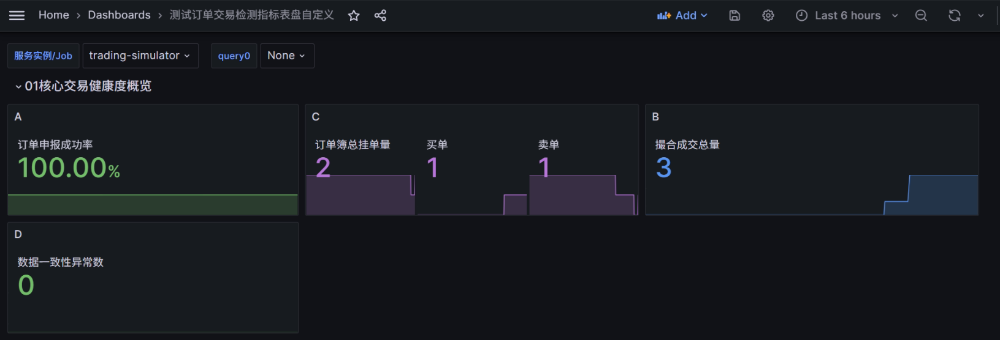

# 模拟股票交易对敲撮合系统 - Java 核心服务模块 项目文档

```
## 一、项目总览
### 1.1 模块定位
### 1.2 项目目标达成情况
### 1.3 整体分层架构
### 1.4 核心架构设计亮点

## 二、具体内容
### 2.1 项目功能简介
### 2.2 核心流程
### 2.3 任务书核心功能列表
#### 2.3.1 基础目标（必选）
#### 2.3.2 高级目标（可选）
### 2.4 Java模块测试案例全量设计
### 2.5 通过IPC对接native模块（TODO）
### 2.6 项目部署到远程服务器
### 2.7 系统可观测性建设(监控)

## 工作小结
```
## 一、项目总览
---

### 1.1 模块定位
本模块为系统**Java核心服务模块**，是整个模拟股票交易撮合系统的**核心调度中枢与业务落地载体**，更是全系统业务流转的核心底座。

核心承担「**请求接入→订单校验→对敲风控→内存撮合→回报生成→数据持久化**」交易全链路核心流程，同时为前端管理界面、C++撮合内核、Python风控/行情分析模块提供标准化对接能力，实现全系统模块的协同调度与业务闭环。

---

### 1.2 项目目标达成情况
本模块严格对标项目任务书要求，全量需求高质量落地，完成度如下：

| 完成度标识 | 目标类别 | 落地详情                                                                 |
| :--------: | -------- |----------------------------------------------------------------------|
| ✅ | 必选基础目标（100%全覆盖） | 完整实现任务书要求的**交易转发、对敲风控、模拟撮合、交易回报**四大核心能力，无功能遗漏                        |
| ✅ | 可选高级目标（核心全落地） | 已实现撤单全流程支持、系统性能优化、全链路监控体系、数据持久化与离线分析支持、高可用崩溃恢复等核心能力                  |
| ✅ | 企业级能力拓展（超任务书要求） | 超出任务书基础要求，落地金融级交易系统必备的**高可用架构设计（崩溃恢复）、数据一致性保障（对账）、全链路可观测日志系统**等工程化能力 |

---

### 1.3 整体分层架构
本模块严格遵循**DDD领域驱动设计思想**，采用四层解耦架构，各层边界清晰、职责单一：

| 架构分层  | 层级定位 | 核心职责与能力 |
|:-----:| -------- | -------------- |
|  接入层  | 请求入口 | 统一HTTP接口入口，标准化请求/响应结构，负责交易/撤单请求接入 |
|  应用层  | 流程编排 | 核心业务流程编排层，封装交易、撤单、风控、撮合、持久化等核心服务，实现全业务流程统一调度 |
|  逻辑层  | 业务核心 | 系统核心业务逻辑层，封装撮合引擎、内存订单簿、风控规则、价格生成策略、订单状态机等核心领域模型 |
| 基础设施层 | 技术支撑 | 负责数据持久化、缓存、配置管理、日志、监控等基础能力落地，为上层业务提供无侵入的技术支撑，实现业务与技术解耦 |

---

### 1.4 核心架构设计亮点
针对证券交易系统「高并发、低延时、高可用、数据强一致」的核心诉求，本模块做了深度的架构设计优化，核心亮点如下：

- 🚀 **撮合与持久化解耦架构**
  设计「**单线程串行撮合 + 独立线程池异步持久化**」核心机制，撮合核心逻辑无锁化执行，彻底解决数据库IO对撮合性能的影响，大幅降低接口响应延时，显著提升系统吞吐量。

- 🔒 **全链路状态机管控**
  基于订单状态枚举实现订单**全生命周期状态流转管控**，严格限制非法状态变更，为撤单操作、撮合执行、崩溃恢复提供强一致的状态依据，从根源上避免状态错乱导致的业务异常。

- 🏦 **金融级高可用兜底设计**
  全链路设计**重试、定期一致性检查、崩溃恢复**三大兜底机制，覆盖服务异常、数据库宕机、网络波动等各类极端场景，保障系统在异常情况下的数据一致性与服务可用性，完全符合金融交易系统的可靠性要求。

- 🧩 **Grafana实现系统运行情况和交易情况可观测性**
  极大的方便发现系统性能问题，同时观测交易情况，是一个复合的监控系统。针对当前项目做了定制化面板指标等操作，设计文档见[此处](./docs/monitoring)。
---

## 二、具体内容

---

### 2.1 项目功能简介
基于SpringBoot实现证券交易撮合模拟系统，核心完成「**订单校验→对敲风控→撮合匹配→交易回报**」全链路，支持**撤单、性能监测**等可插拔增强模块。
1. 提供JAVA层的[撮合](src/main/java/com/example/trading/application/ExchangeService.java)、[对敲检测](src/main/java/com/example/trading/domain/risk/SelfTradeChecker.java)、[交易和撤单请求校验](src/main/java/com/example/trading/domain/validation)方案；
   - [提供撮合结果,**支持一笔订单分多次成交**](src/main/java/com/example/trading/domain/engine/result/MatchingResult.java)
   - [撮合引擎Java设计](src/main/java/com/example/trading/domain/engine/MatchingEngine.java)、[订单簿作为订单内存缓存](src/main/java/com/example/trading/domain/engine/OrderBook.java)（[图片流程见此处03](docs/data/03-OrderBookStructure.png)）
   - [价格生成策略多种实现自定义可手动配置yml选择](src/main/java/com/example/trading/domain/engine/PriceGenerator.java)
   - [MyBatis实现持久化](src/main/java/com/example/trading/mapper)
   - [**整体项目配置文件**application.yml](src/main/resources/application.yml)
     - 包括下面配置：MySQL、MyBatis、插入重试（见6）、分页、自定义开启对敲检测（见1）、价格策略（见1）、崩溃重启（见5）、性能监测（见3）
2. [基于**状态流转**机制实现撤单功能](src/main/java/com/example/trading/application/CancelService.java)；
   - [状态定义](src/main/java/com/example/trading/common/enums/OrderStatusEnum.java)
3. 提供**图形化的性能检测平台**(JVM+SQL检测集成)，使用Prometheus+Grafana，开发[整体启动和停止脚本](docs)（start* & stop*.bat），[自定义表盘](docs)（./docs/09-*）；
4. 提供完善的日志，使用logback在本地自动保存**所有操作的中间日志**（[等级设置INFO](src/main/resources/logback.xml)，路径./logs）；
5. 提供完善的[**崩溃恢复机制**](src/main/java/com/example/trading/infrastructure/persistence/OrderRecoveryService.java)，**应用重启后**自动从数据库读取中间状态订单（状态流转机制）；
   - 见此处[图04-*](docs/data)
6. 提供完善的数据库失败重试机制，独立入库线程（见7） → [基于Redis暂存功能实现**入库失败重试**](src/main/java/com/example/trading/application/PersistRetryTaskJob.java) → [订单数据**定期对账服务**](src/main/java/com/example/trading/application/OrderReconciliationService.java)（5min一次的定时服务）机制；
7. 模块设计采用[**单线程撮合**](src/main/java/com/example/trading/application/ExchangeService.java)(#processOrder)+[**线程池入库分离**](src/main/java/com/example/trading/application/AsyncPersistService.java)的机制，提供高性能的服务，降低服务延迟（防止数据库影响HTTP请求响应速度）；
   - [线程池和任务池配置](src/main/java/com/example/trading/config/AsyncConfig.java)
8. [统一的**响应结构设计**](src/main/java/com/example/trading/application/response)、[错误码设计](src/main/java/com/example/trading/common/enums/ErrorCodeEnum.java)、[响应码设计](src/main/java/com/example/trading/common/enums/ResponseCodeEnum.java)；
9. [订单&成交记录 **数据库表结构设计**](docs/sql)。

---
### 2.2 核心流程
1. **订单接收**：客户端POST JSON订单到/api/trading/order接口；
2. **基础校验**：OrderValidator校验订单合法性，失败则返回非法回报；
3. **风控检查**：SelfTradeChecker检测对敲风险，失败则返回非法回报；
4. **撮合匹配**：MatchingEngine将订单加入订单簿，尝试与对手方订单撮合；
5. **回报生成**：根据处理结果返回成功/成交/非法回报JSON；
6. **撤单流程**：接收JSON扯淡请求，撤销未完成订单，已经处于终态的订单不可撤销
7. **崩溃重启**订单加载和批量撮合
8. **数据入库**流程和失败重试和兜底定期检查报告流程

---
### 2.3 任务书核心功能列表
> [整体架构设计简图](docs/data/02-分工.png) ；
> 
> [Java模块项目架构设计](docs/design.md)。
#### 2.3.1 基础目标（必选）
1. 交易转发：接收JSON订单，完成基础合法性校验，输出确认/非法回报
   - 实现标准化订单 / 回报转发逻辑，支持 JSON 格式订单接收与返回
   - 实现全维度订单合法性校验，对无效订单输出标准化非法回报
   - 实现统一回报转发机制，支持全类型回报的标准化输出
2. 对敲风控：检测同一股东号自买自卖行为，拦截违规订单并输出非法回报
   - 实现同股东号对敲交易的精准检测与拦截，禁止违规订单进入撮合环节
   - 对触发对敲风险的订单，输出标准化非法回报，明确驳回原因与错误码
   - 支持配置文件一键开启 / 关闭风控，适配不同测试场景
3. 模拟撮合：维护订单簿，实现价格优先+时间优先撮合，支持零股成交和成交价生成
   - 基于「价格优先、时间优先」规则实现完整撮合引擎，维护内存订单簿
   - 实现多模式成交价生成算法，支持策略化切换
   - 支持一笔订单分多笔成交，完整处理零股成交场景
   - 对手方订单成交后自动从订单簿移除，保证订单状态一致性
4. 交易回报：统一输出JSON格式的确认/成交/非法回报
   - 严格遵循任务书定义的数据结构，实现全类型回报标准化输出，覆盖订单确认、订单非法、订单成交、撤单确认、撤单非法五大类回报

#### 2.3.2 高级目标（可选）
1. 撤单支持：处理撤单请求，输出撤单确认/非法回报
   - 实现标准化撤单请求接收与处理，基于订单状态机严格校验撤单合法性
   - 支持未成交 / 部分成交订单撤单，终态订单禁止撤单
   - 撤单成功后自动更新订单簿，释放对应额度，输出标准化撤单确认回报
   - 非法撤单请求输出标准化驳回回报，明确驳回原因
2. 性能优化：分析瓶颈并优化吞吐量/延时（基于性能检测平台实现）
   - 基于 Prometheus+Grafana 搭建全链路性能监测平台，实现 JVM、SQL、接口、撮合性能的实时可视化监测
   - 定位并解决数据库 IO、锁竞争等核心性能瓶颈，通过撮合与持久化解耦、无锁化撮合、异步入库等方案，实现吞吐量与延时的深度优化
   - 提供一键启停脚本，适配测试与生产环境部署

---
### 2.4 Java模块测试案例全量设计
- [测试案例设计文档目录](docs/test-cases)（TestCase-0*是具体功能的案例设计）

---
### 2.5 通过IPC对接native模块（TODO）
> [请求设计](../protocol)（根目录protocol路径下）
1. 撮合C++
2. 风控Python
3. 行情分析Python

---
### 2.6 项目部署 到远程服务器
- [部署文档](./docs/11-Java模块部署步骤.md)
```
重点：由于服务器端口开放问题，访问前需要安装PuTTY通过SSH隧道实现访问。具体操作参考文档并从网络上查找配置方法。
1. 配置网址、端口
   打开 PuTTY，先填服务器基本信息
   Host Name：129.211.187.179
   Port：22
   Connection type：SSH

2. 添加需要访问的端口：Connection → SSH → Tunnels，每条都按下面填 → 点 Add
   ① 映射项目端口 8081
   Source port：8081
   Destination：127.0.0.1:8081
   → 点 Add
   ② 映射 MySQL 监控 9104
   Source port：9104
   Destination：127.0.0.1:9104
   → 点 Add
   ③ 映射 Prometheus 9090
   Source port：9090
   Destination：127.0.0.1:9090
   → 点 Add
   ④ 映射 Grafana 3000
   Source port：3000
   Destination：127.0.0.1:3000
   → 点 Add
   添加完成显示：
   L8081  127.0.0.1:8081
   L9104  127.0.0.1:9104
   L9090  127.0.0.1:9090
   L3000  127.0.0.1:3000
       
3. 左边回到 Session
点底部 Open → 输入账号密码
```

---
### 2.7 系统可观测性建设(监控)
[指标设计、文档输出、结果展示等内容地址](./docs/monitoring)


---
## 工作小结

| 交付类别 | 交付内容明细                                         |
| --- |------------------------------------------------|
| 核心代码 | 完成Java核心服务模块全量代码开发，覆盖8大核心业务模块，40+核心类，实现交易全链路闭环 |
| 架构设计 | 整体架构设计文档、订单簿结构设计、状态机设计、数据流程设计等全套设计文档           |
| 数据库设计 | 2张核心业务表结构设计，完整DDL脚本，适配MySQL数据库                 |
| 测试体系 | 全场景测试案例设计文档，覆盖功能、边界、异常、性能四大类测试场景               |
| 部署交付 | 一键启停检测平台服务脚本、环境配置文件、监控表盘、部署文档                  |
| 文档体系 | 需求分析文档、架构设计文档、IPC接口文档、测试文档等项目文档                |
