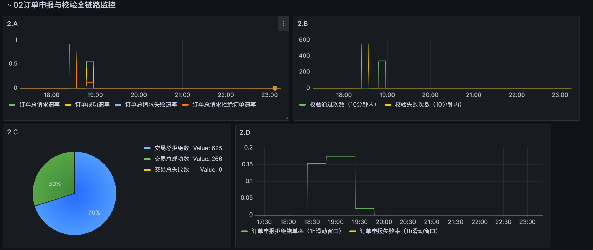
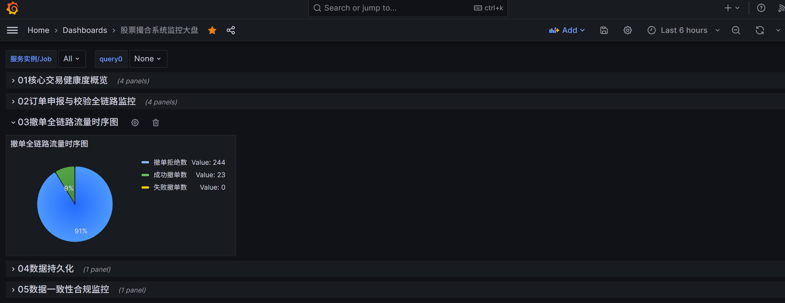
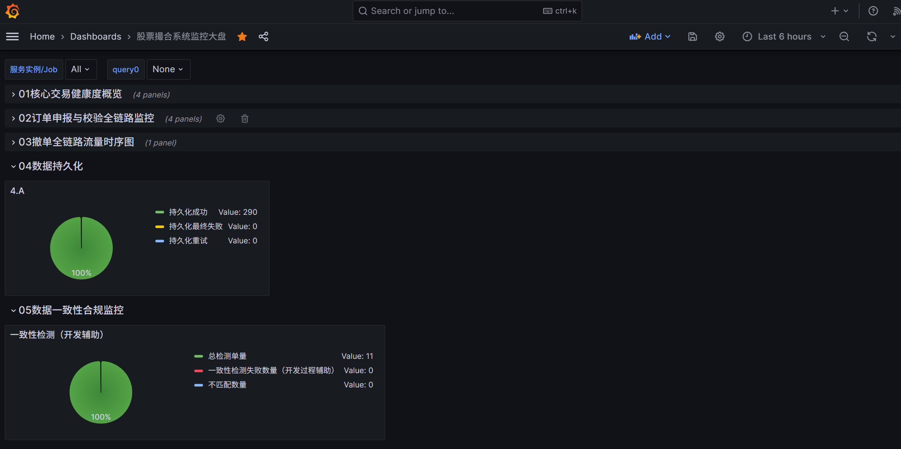

# 总体表盘指标设计& 对应代码展示

## 1 指标设计
> 访问表盘地址端口：http://ip:3000

### 1.1 大盘全局基础配置

| 配置项 | 参数值                                                                                                                                             | 说明 |
|--------|-------------------------------------------------------------------------------------------------------------------------------------------------|------|
| 大盘名称 | 股票撮合交易系统核心监控大盘                                                                                                                                  | 支持多实例切换 |
| 全局刷新间隔 | 交易时段1s，非交易时段5s                                                                                                                                  | 适配交易系统实时性要求 |
| 默认时间范围 | 最近1小时                                                                                                                                           | 支持快速切换至当日/分时行情 |
| 全局变量 | 变量名：`job`，类型：Query（Options：Label values- job- trading_order_success_total），selection option（Multi& Include All），Sort（Alph-asc），Refresh（on time） | 用于筛选对应微服务实例，支持集群多节点切换 |

---

### 1.2 分模块表盘详细设计

#### Row 1：核心交易健康度概览（置顶黄金位，核心KPI）
**定位**：全角色一眼可见的系统健康度，采用Stat大数字面板，适配交易大厅/运维监控屏。

##### Panel 1.1 订单申报成功率
- **Grafana表盘类型**：Stat 面板
- **完整操作路径**：Dashboards → 新建大盘 → 右上角【Add panel】→ 右侧【Visualization】下拉菜单 → 选择【Stat】（核心可视化分类首位）
- **核心观测目标**：交易系统核心健康度指标，实时监控订单申报的整体成功比例
- **用到的原始指标**：`trading.order.success`、`trading.order.total`
- **PromQL高级运算表达式**（带除零保护，避免无流量时出现NaN）：
  ```promql
  # 1m滑动窗口订单申报成功率，保留4位小数，金融级精度
    sum(rate(trading_order_success{job=~"$job"}[5m])) / clamp_min(sum(rate(trading_order_total{job=~"$job"}[5m])), 1)
  ```
- **可视化配置要点**：
  - 单位：`Percent (0.0-1.0)`，小数位数2位
  - 颜色阈值：绿色（≥0.999，即99.9%）、黄色（0.99-0.999）、红色（<0.99）
  - 显示模式：值+趋势图，趋势图与大盘时间范围同步
- **告警阈值**：连续2个周期成功率<99.9%触发P2告警；<99%触发P1紧急告警

##### Panel 1.2 撮合成交总量（今日累计）
- **Grafana表盘类型**：Stat 面板
- **操作路径**：同上
- **核心观测目标**：当日累计撮合成交笔数，监控交易活跃度与撮合引擎吞吐量
- **用到的原始指标**：`trading.trade.total`、`trading.trade.recovery.total`
- **PromQL高级运算表达式**：
  ```promql
  # 今日累计撮合成交总量=被动正常成交+灾备恢复主动成交
  sum(increase(trading_trade_total{job=~"$job"}[1h])) + sum(increase(trading_trade_recovery_total{job=~"$job"}[1h]))
  ```
- **可视化配置**：单位`Short`（数字简写），颜色蓝色，显示值+趋势图
- **告警规则**：无，仅做业务观测

##### Panel 1.3 订单簿总挂单量
- **Grafana表盘类型**：Stat 面板
- **操作路径**：同上
- **核心观测目标**：订单簿当前总挂单量，监控市场深度与撮合引擎运行状态
- **用到的原始指标**：`trading.orderbook.orders`
- **PromQL表达式**（Gauge瞬时值直接取值）：
  ```promql
  sum(trading_orderbook_orders{job=~"$job"})
  ```
- **可视化配置**：单位`Short`，颜色紫色，显示值+趋势图
- **告警阈值**：连续1分钟总挂单量=0，触发P1告警（撮合引擎可能异常宕机）

##### Panel 1.4 数据一致性异常数（今日累计）
- **Grafana表盘类型**：Stat 面板
- **操作路径**：同上
- **核心观测目标**：当日对账发现的订单数据不匹配总数，金融合规核心红线指标
- **用到的原始指标**：`trading.consistency.check.mismatch`
- **PromQL表达式**：
  ```promql
  sum(increase(trading_consistency_check_mismatch_total{job=~"$job"}[1d]))
  ```
- **可视化配置**：单位`Short`，阈值：绿色=0，黄色≥1，红色≥5
- **告警阈值**：只要出现≥1，立即触发P0最高级别告警（金融系统数据一致性属于重大事故）

---

#### Row 2：订单申报与校验全链路监控
**定位**：订单从进入系统→校验→受理的全流程监控，定位前置环节异常。

##### Panel 2.1 订单申报全链路流量时序图
- **Grafana表盘类型**：TimeSeries 时序图
- **完整操作路径**：Add panel → Visualization → 选择【TimeSeries】（核心可视化分类第二位）
- **核心观测目标**：实时监控订单总请求、成功、失败、拒绝的流量变化，定位流量尖峰和异常节点
- **用到的原始指标**：`trading.order.total`、`trading.order.success`、`trading.order.failed`、`trading.order.reject`
- **PromQL表达式（4个Query同面板叠加）**：
  ```promql
  # Query A: 订单总请求速率（1m滑动窗口，每秒平均请求数）
  sum(rate(trading_order_total{job=~"$job"}[3h]))
  # Query B: 订单成功速率
  sum(rate(trading_order_success_total{job=~"$job"}[1m]))
  # Query C: 订单处理失败速率
  sum(rate(trading_order_failed_total{job=~"$job"}[1m]))
  # Query D: 订单拒绝速率
  sum(rate(trading_order_reject_total{job=~"$job"}[1m]))
  ```
- **可视化配置**：
  - 图例：右侧显示，包含名称+当前值
  - 线条样式：总请求=灰色虚线，成功=绿色实线，失败=红色实线，拒绝=黄色实线
  - Y轴单位：`Ops/sec`（每秒操作数），小数位数2位
- **告警阈值**：失败速率连续2个周期>10笔/秒，触发P2告警

##### Panel 2.2 订单校验通过率与失败占比
- **Grafana表盘类型**：PieChart 饼图
- **完整操作路径**：Add panel → Visualization → 下拉找到【Pie chart】（Pie分类下）
- **核心观测目标**：订单校验环节的通过/失败占比，定位前置风控/校验环节的异常
- **用到的原始指标**：`trading.order.validate.pass`、`trading.order.validate.fail`
- **PromQL表达式**：
  ```promql
  # Query A: 校验通过次数（1h滑动窗口累计）
  sum(increase(trading_order_validate_pass_total{job=~"$job"}[1h]))
  # Query B: 校验失败次数（1h滑动窗口累计）
  sum(increase(trading_order_validate_fail_total{job=~"$job"}[1h]))
  ```
- **可视化配置**：饼图+百分比标签，通过=绿色，失败=红色，图例显示名称+数值+百分比
- **告警阈值**：校验失败占比>1%，触发P2告警

##### Panel 2.3 订单申报失败率时序图
- **Grafana表盘类型**：TimeSeries 时序图
- **操作路径**：同上
- **核心观测目标**：监控订单失败率的变化趋势，提前发现系统性能/业务异常
- **用到的原始指标**：`trading.order.failed`、`trading.order.total`
- **PromQL高级运算表达式**：
  ```promql
  # 订单申报失败率（1m滑动窗口，带除零保护）
  sum(rate(trading_order_failed_total{job=~"$job"}[1m])) / clamp_min(sum(rate(trading_order_total{job=~"$job"}[1m])), 1)
  ```
- **可视化配置**：
  - Y轴单位：`Percent (0.0-1.0)`，固定范围0-0.05（0-5%），聚焦异常区间
  - 线条：红色实线+填充，阈值线：0.01（1%）黄色虚线，0.03（3%）红色虚线
- **告警阈值**：失败率>1%持续2分钟触发P2告警；>3%持续1分钟触发P1告警

---

#### Row 3：撤单全链路监控
**定位**：撤单从请求→校验→执行的全流程监控，保障用户撤单需求的合规执行。

##### Panel 4.1 撤单全链路流量时序图
- **Grafana表盘类型**：TimeSeries 时序图
- **操作路径**：同上
- **核心观测目标**：监控撤单总请求、成功、拒绝、失败的流量变化，定位撤单异常节点
- **用到的原始指标**：`trading.cancel.total`、`trading.cancel.success`、`trading.cancel.reject`、`trading.cancel.failed`
- **PromQL表达式**：
  ```promql
  # Query B: 撤单成功
  sum(rate(trading_cancel_success_total{job=~"$job"}[1m]))
  # Query C: 撤单拒绝
  sum(rate(trading_cancel_reject_total{job=~"$job"}[1m]))
  # Query D: 撤单处理失败
  sum(rate(trading_cancel_failed_total{job=~"$job"}[1m]))
  ```
- **可视化配置**：总请求=灰色虚线，成功=绿色实线，拒绝=黄色实线，失败=红色实线，Y轴单位`笔/秒`
- **告警阈值**：撤单失败速率>5笔/秒持续2个周期，触发P2告警

#### Row 4：数据持久化与灾备恢复监控
**定位**：订单数据落地、重试、灾备恢复能力监控，保障交易数据不丢失、可恢复。

##### Panel 4.1 数据持久化全链路时序图
- **Grafana表盘类型**：TimeSeries 时序图
- **操作路径**：同上
- **核心观测目标**：监控订单数据持久化的成功、失败、重试速率，定位数据库/存储层异常
- **用到的原始指标**：`trading.persist.success.total`、`trading.persist.fail.total`、`trading.persist.retry.total`
- **PromQL表达式**：
  ```promql
  # Query A: 持久化成功速率
  sum(rate(trading_persist_success_total{job=~"$job"}[1m]))
  # Query B: 持久化最终失败速率
  sum(rate(trading_persist_fail_total{job=~"$job"}[1m]))
  # Query C: 持久化重试速率
  sum(rate(trading_persist_retry_total{job=~"$job"}[1m]))
  ```
- **可视化配置**：成功=绿色实线，失败=红色实线，重试=黄色实线，Y轴单位`笔/秒`
- **告警阈值**：持久化失败速率>0持续1个周期，触发P1告警（数据无法落地，严重故障）；重试速率>10笔/秒持续2分钟，触发P2告警

#### Row 5：数据一致性合规监控（金融系统生命线）
**定位**：对账任务执行、数据一致性监控，满足金融监管合规要求。

##### Panel 5.1 一致性检查任务执行情况时序图
- **Grafana表盘类型**：TimeSeries 时序图
- **操作路径**：同上
- **核心观测目标**：监控对账任务的执行总次数、失败次数，保障对账任务正常执行
- **用到的原始指标**：`trading.consistency.check.total`、`trading.consistency.check.failed`
- **PromQL表达式**：
  ```promql
  # Query A: 对账任务执行总次数（10m累计）
  sum(increase(trading_consistency_check_total{job=~"$job"}[3h]))
  # Query B: 对账任务执行失败次数（10m累计）
  sum(increase(trading_consistency_check_failed_total{job=~"$job"}[3h]))
  ```
- **可视化配置**：总执行=蓝色实线，失败=红色实线，Y轴单位`次`
- **告警阈值**：对账任务失败次数≥1，立即触发P2告警（对账任务无法执行，合规风险）

### 1.3 全指标设计汇总表:查找的时候下划线连接，total结尾
| 原始指标名称                          | 指标类型 | 业务模块归属       | 核心运算方式               | 所属表盘位置               |
|---------------------------------------|----------|--------------------|----------------------------|----------------------------|
| `trading.order.total`                 | Counter  | 订单申报链路       | rate()计算每秒请求速率     | Row1.1、Row2.1、Row2.3    |
| `trading.order.success`               | Counter  | 订单申报链路       | rate()计算成功速率、算成功率 | Row1.1、Row2.1          |
| `trading.order.failed`                | Counter  | 订单申报链路       | rate()计算失败速率、算失败率 | Row2.1、Row2.3          |
| `trading.order.reject`                | Counter  | 订单申报链路       | rate()计算拒绝速率         | Row2.1                     |
| `trading.order.validate.total`        | Counter  | 订单校验环节       | 累计值算占比               | Row2.2                     |
| `trading.order.validate.pass`         | Counter  | 订单校验环节       | increase()算周期累计       | Row2.2                     |
| `trading.order.validate.fail`         | Counter  | 订单校验环节       | increase()算周期累计、算失败占比 | Row2.2             |
| `trading.trade.total`                 | Counter  | 撮合引擎           | rate()算成交速率、increase()算累计 | Row1.2、Row3.3      |
| `trading.trade.recovery.total`        | Counter  | 撮合引擎/灾备恢复 | rate()算成交速率、increase()算累计 | Row1.2、Row3.3、Row5.3 |
| `trading.orderbook.orders`            | Gauge    | 撮合引擎订单簿     | 直接取瞬时值               | Row1.3                     |
| `trading.orderbook.buy.total_size`    | Gauge    | 订单簿深度         | 直接取瞬时值、算占比       | Row3.1、Row3.2             |
| `trading.orderbook.sell.total_size`   | Gauge    | 订单簿深度         | 直接取瞬时值、算占比       | Row3.1、Row3.2             |
| `trading.cancel.request.total`        | Counter  | 撮合引擎撤单       | rate()算请求速率           | Row3.4                     |
| `trading.cancel.total`                 | Counter  | 撤单执行链路       | rate()算请求速率、算成功率 | Row4.1、Row4.3             |
| `trading.cancel.success`               | Counter  | 撤单执行链路       | rate()算成功速率、算成功率 | Row4.1、Row4.3             |
| `trading.cancel.reject`                | Counter  | 撤单执行链路       | rate()算拒绝速率           | Row4.1                     |
| `trading.cancel.failed`                | Counter  | 撤单执行链路       | rate()算失败速率           | Row4.1                     |
| `trading.cancel.validate.total`        | Counter  | 撤单校验环节       | 累计值算占比               | Row4.2                     |
| `trading.cancel.validate.pass`         | Counter  | 撤单校验环节       | increase()算周期累计       | Row4.2                     |
| `trading.cancel.validate.fail`         | Counter  | 撤单校验环节       | increase()算周期累计、算失败占比 | Row4.2             |
| `trading.persist.fail.total`           | Counter  | 数据持久化         | rate()算失败速率           | Row5.1                     |
| `trading.persist.retry.total`          | Counter  | 数据持久化         | rate()算重试速率、算重试率 | Row5.1、Row5.2             |
| `trading.persist.success.total`        | Counter  | 数据持久化         | rate()算成功速率           | Row5.1、Row5.2             |
| `trading.consistency.check.total`      | Counter  | 一致性对账         | increase()算累计、算成功率 | Row6.1、Row6.3             |
| `trading.consistency.check.failed`     | Counter  | 一致性对账         | increase()算累计、算失败率 | Row6.1、Row6.3             |
| `trading.consistency.check.mismatch`   | Counter  | 一致性对账         | increase()算新增、sum()算累计 | Row1.4、Row6.2         |
| `trading.recovery.task.failed`         | Counter  | 灾备恢复           | increase()算累计           | Row5.3                     |
| `trading.recovery.order.success`       | Counter  | 灾备恢复           | increase()算累计           | Row5.3                     |
| `trading.recovery.order.fail`          | Counter  | 灾备恢复           | increase()算累计           | Row5.3                     |
| `trading.recovery.trade.total`         | Counter  | 灾备恢复           | increase()算累计           | Row5.3                     |


---

## 2 Grafana 自定义模板导入导出方法

#### 2.1 导出表盘为 JSON 模板
1. 从原机器导出仪表盘时，不要直接复制 JSON Model，一定要用官方的「分享导出」功能： 
   - 点击左侧Menu最右边分享图标 → 切换到 Export 选项卡 
   - 必须勾选 Export for sharing externally
   - Save

#### 2.2 导入 JSON 模板到 Grafana
[模板在此处](./股票撮合系统监控大盘-1772551751245.json)

##### 报错处理：
```logcatfilter
Templating
Failed to upgrade legacy queries Datasource cfea0fb6-297c-4f6d-9a4d-be70415894c5 was not found
原因和处理方法：
你导出的 JSON 文件里，硬编码了原机器的数据源唯一 ID（UUID），不要直接复制JSON编码，重新导出。
```


## 3 结果展示






## 4 具体代码
```
// 1.
public class OrderConsistencyCheckService:
    private Counter checkTotalCounter;      // 检查任务执行总次数
    private Counter checkFailedCounter;     // 检查任务执行失败次数
    private Counter checkMismatchCounter;   // 发现数据不匹配的订单总数

    @PostConstruct
    public void initMetrics() {
        checkTotalCounter = meterRegistry.counter("trading.consistency.check.total");
        checkFailedCounter = meterRegistry.counter("trading.consistency.check.failed");
        checkMismatchCounter = meterRegistry.counter("trading.consistency.check.mismatch");
    }

// 2.
public class AsyncPersistService:
    private Counter persistFailCounter;
    private Counter persistRetryCounter;
    private Counter persistSuccessCounter;

    @PostConstruct
    public void initMetrics() {
        // 初始化带标签的计数器
        persistFailCounter = Counter.builder("trading.persist.fail.total")
                .description("持久化最终失败次数")
                .register(meterRegistry);
        persistRetryCounter = Counter.builder("trading.persist.retry.total")
                .description("持久化重试次数总和")
                .register(meterRegistry);
        persistSuccessCounter = Counter.builder("trading.persist.success.total")
                .description("持久化成功次数")
                .register(meterRegistry);
    }

// 3.
public class CancelService:
    /* 撤单请求总次数计数器 */
    private Counter cancelTotalCounter;
    /* 撤单成功次数计数器 */
    private Counter cancelSuccessCounter;
    /* 撤单被拒绝次数计数器 */
    private Counter cancelRejectCounter;
    /* 撤单处理失败次数计数器 */
    private Counter cancelFailedCounter;

    @PostConstruct
    public void initMetrics() {
        cancelTotalCounter = meterRegistry.counter("trading.cancel.total");
        cancelSuccessCounter = meterRegistry.counter("trading.cancel.success");
        cancelRejectCounter = meterRegistry.counter("trading.cancel.reject");
        cancelFailedCounter = meterRegistry.counter("trading.cancel.failed");
    }

// 4.
public class CancelValidator:
    /* 监控指标注册器 */
    private final MeterRegistry meterRegistry;
    /* 撤单校验总次数计数器 */
    private Counter cancelValidateTotalCounter;
    /* 撤单校验通过次数计数器 */
    private Counter cancelValidatePassCounter;
    /* 撤单校验总失败次数计数器 */
    private Counter cancelValidateFailCounter;

    @PostConstruct
    public void initMetrics() {
        // 仅初始化3个核心计数器，无细分标签
        cancelValidateTotalCounter = meterRegistry.counter("trading.cancel.validate.total");
        cancelValidatePassCounter = meterRegistry.counter("trading.cancel.validate.pass");
        cancelValidateFailCounter = meterRegistry.counter("trading.cancel.validate.fail");
    }

// 5.
public class ExchangeService:
    /* 订单请求总次数计数器 */
    private Counter orderTotalCounter;
    /* 订单成功次数计数器 */
    private Counter orderSuccessCounter;
    /* 订单处理失败次数计数器 */
    private Counter orderFailedCounter;
    /* 订单被拒绝次数计数器 */
    private Counter orderRejectCounter;

    @PostConstruct
    public void init() {
        orderTotalCounter = meterRegistry.counter("trading.order.total");
        orderSuccessCounter = meterRegistry.counter("trading.order.success");
        orderFailedCounter = meterRegistry.counter("trading.order.failed");
        orderRejectCounter = meterRegistry.counter("trading.order.reject");
    }

// 6.
public class MatchingEngine:
    /* 订单簿中订单总数 */
    private AtomicInteger orderBookOrderCount;
    /* 被动撮合成交总次数计数器 */
    private Counter tradeTotalCounter;
    /* 主动撮合成交总次数计数器 */
    private Counter tradeRecoveryTotalCounter;
    /* 撤单请求总次数计数器 */
    private Counter cancelRequestTotalCounter;

    @PostConstruct
    public void initMetrics() {
        tradeTotalCounter = meterRegistry.counter("trading.trade.total");
        tradeRecoveryTotalCounter = meterRegistry.counter("trading.trade.recovery.total");
        cancelRequestTotalCounter = meterRegistry.counter("trading.cancel.request.total");
        orderBookOrderCount = new AtomicInteger(0);
        Gauge.builder("trading.orderbook.orders", orderBookOrderCount, AtomicInteger::get)
                .description("订单簿中当前订单总数")
                .register(meterRegistry);
        log.info("撮合引擎监控指标初始化完成");
    }

// 7.
public class OrderBook:
    /* 订单簿买队列总订单数 */
    private Gauge buyQueueSizeGauge;
    /* 订单簿卖队列总订单数 */
    private Gauge sellQueueSizeGauge;
    @PostConstruct
    public void initMetrics() {
        buyQueueSizeGauge = Gauge.builder("trading.orderbook.buy.total_size", () -> {
            int totalBuySize = 0;
            for (ConcurrentMap<SideEnum, ConcurrentSkipListMap<BigDecimal, PriorityBlockingQueue<Order>>> sideMap : orderBookMap.values()) {
                ConcurrentSkipListMap<BigDecimal, PriorityBlockingQueue<Order>> buyPriceMap = sideMap.get(SideEnum.BUY);
                if (buyPriceMap != null) {
                    for (PriorityBlockingQueue<Order> orderQueue : buyPriceMap.values()) {
                        totalBuySize += orderQueue.size();
                    }
                }
            }
            return totalBuySize;
        }).description("订单簿买队列总订单数").register(meterRegistry);

        sellQueueSizeGauge = Gauge.builder("trading.orderbook.sell.total_size", () -> {
            int totalSellSize = 0;
            for (ConcurrentMap<SideEnum, ConcurrentSkipListMap<BigDecimal, PriorityBlockingQueue<Order>>> sideMap : orderBookMap.values()) {
                ConcurrentSkipListMap<BigDecimal, PriorityBlockingQueue<Order>> sellPriceMap = sideMap.get(SideEnum.SELL);
                if (sellPriceMap != null) {
                    for (PriorityBlockingQueue<Order> orderQueue : sellPriceMap.values()) {
                        totalSellSize += orderQueue.size();
                    }
                }
            }
            return totalSellSize;
        }).description("订单簿卖队列总订单数").register(meterRegistry);

        log.info("订单簿监控指标初始化完成");
    }

// 8.
public class OrderConsistencyCheckService:
    private Counter checkTotalCounter;      // 检查任务执行总次数
    private Counter checkFailedCounter;     // 检查任务执行失败次数
    private Counter checkMismatchCounter;   // 发现数据不匹配的订单总数

    @PostConstruct
    public void initMetrics() {
        checkTotalCounter = meterRegistry.counter("trading.consistency.check.total");
        checkFailedCounter = meterRegistry.counter("trading.consistency.check.failed");
        checkMismatchCounter = meterRegistry.counter("trading.consistency.check.mismatch");
    }

// 9.
public class OrderRecoveryService implements CommandLineRunner:
    /* 订单恢复任务执行失败次数计数器 */
    private Counter recoveryTaskFailedCounter;
    /* 订单恢复成功数量计数器 */
    private Counter recoveryOrderSuccessCounter;
    /* 订单恢复失败数量计数器 */
    private Counter recoveryOrderFailCounter;
    /* 恢复后主动撮合成交数量计数器 */
    private Counter recoveryTradeTotalCounter;

    @PostConstruct
    public void initMetrics() {
        recoveryTaskFailedCounter = meterRegistry.counter("trading.recovery.task.failed");
        recoveryOrderSuccessCounter = meterRegistry.counter("trading.recovery.order.success");
        recoveryOrderFailCounter = meterRegistry.counter("trading.recovery.order.fail");
        recoveryTradeTotalCounter = meterRegistry.counter("trading.recovery.trade.total");
    }

// 10.
public class OrderValidator:
    /* 订单校验通过次数计数器 */
    private Counter orderValidatePassCounter;
    /* 订单校验总失败次数计数器 */
    private Counter orderValidateFailCounter;

    @PostConstruct
    public void initMetrics() {
        // 仅初始化3个核心计数器，无细分标签
        orderValidateTotalCounter = meterRegistry.counter("trading.order.validate.total");
        orderValidatePassCounter = meterRegistry.counter("trading.order.validate.pass");
        orderValidateFailCounter = meterRegistry.counter("trading.order.validate.fail");
    }


```
